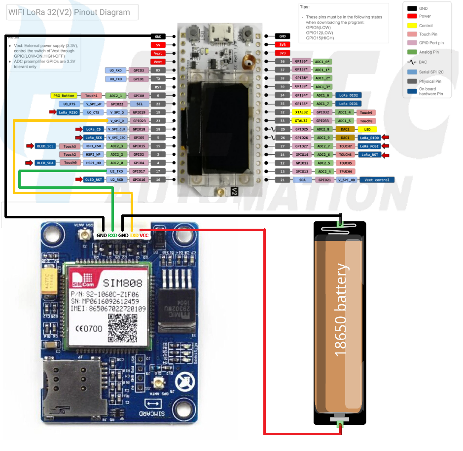

# Medidor RSSI LoRaWAN + GPS SIM808 — Heltec WiFi LoRa 32 V2

Firmware para **Heltec WiFi LoRa 32 V2 (ESP32)** que mide la calidad del enlace **LoRaWAN** (RSSI y SNR de ida y vuelta con Node-RED) y agrega a cada uplink la **posición GNSS leída del SIM808**. Todo se muestra en la **OLED integrada**.

Unifica dos proyectos:

- **Medidor RSSI V2.8** (German Mizdraji, Macro Intell S.A.): esquema de prueba de red (PDR) y envío periódico de mediciones por LoRaWAN. Se conserva el esquema de transmisión.
- **Heltec SIM808 GPS**: lectura del GNSS del SIM808 por comandos AT.

## Descripción

1. Al arrancar, el nodo envía un **uplink confirmado (PDR)** y espera el ACK; si no llega en 75 s reintenta tras una espera aleatoria de 5–9 s.
2. Con el PDR aprobado, envía cada **10 s** un uplink de medición (`PaqueteSalida()`).
3. Node-RED responde a cada uplink con un downlink `tx,gateway,seq`. El nodo mide el **RSSI** y el **SNR** de ese downlink.
4. Cada uplink lleva el RSSI/SNR de la medición anterior, el SF utilizado y la **última posición GPS** (si tiene como máximo 30 s de antigüedad).
5. El SF de cada uplink rota SF7 → SF8 → SF9 → SF10 → SF7.
6. En paralelo, una tarea independiente consulta el GNSS del SIM808 cada 2 s.

Solo se usan coordenadas reales del GNSS del SIM808: no hay coordenadas simuladas ni posicionamiento por red celular.

## Protocolo LoRaWAN

| Mensaje | Formato | Ejemplo |
| ------- | ------- | ------- |
| Uplink (puerto 1) | `tx,rx,seq,sf,snr,lat,long` | `-115,-98,15,7,-3.25,-27.468703,-58.829450` |
| Downlink (Node-RED) | `tx,gateway,seq` | `-115,macrointell,15` |

Campos del uplink:

| Campo | Significado |
| ----- | ----------- |
| `tx` | RSSI con el que el gateway recibió el uplink anterior (viene en el downlink) |
| `rx` | RSSI con el que el nodo recibió ese downlink (`lora.getRssi()`) |
| `seq` | Secuencia del downlink, devuelta a Node-RED |
| `sf` | SF con el que salió el uplink que produjo ese `tx` |
| `snr` | SNR del downlink en dB, dos decimales (`getPktSnrRaw() / 4`) |
| `lat`, `long` | Última posición GPS del SIM808, grados decimales WGS84 con 6 decimales (~0.1 m, la resolución que entrega el SIM808) |

Reglas para `lat`/`long`:

- Se toma la última posición **con fix válido** obtenida por la tarea GPS.
- Si esa posición tiene **más de 30 s** (`GPS_MAX_AGE_FOR_UPLINK_MS`) o nunca hubo fix, se envía `lat=0`, `long=0` (ej. `-115,-98,15,7,-3.25,0,0`).
- Antes de la primera medición, `tx`, `rx`, `seq`, `sf` y `snr` valen 0 (igual que en V2.8).
- El uplink confirmado del PDR usa el mismo formato.
- Downlinks que no cumplen `-NNN,gateway,NNN` (p. ej. comandos MAC) se descartan y se registran en hexadecimal por Serial.

Detección de falla (igual que V2.8): si se envían más de 3 uplinks periódicos que los downlinks recibidos, la OLED muestra `Rx:....` hasta la próxima medición válida.

## Hardware

- **Heltec WiFi LoRa 32 V2** (ESP32 + SX1276 + OLED SSD1306 0.96").
- **Antena LoRa 915 MHz** en el conector de la placa (no transmitir sin antena).
- **Módulo SIM808** (breakout genérico, DFRobot, Adafruit FONA 808 u otro).
- **Antena GPS** conectada al conector *GPS/GNSS* del módulo (no al de GSM). Si es activa, verificar que el módulo la alimente.
- **Fuente para el SIM808**: 3.4–4.4 V capaz de entregar **2 A** de pico (ver [Alimentación](#alimentación)).
- Cables y, si el módulo no tiene adaptación de niveles, un **adaptador de niveles** o divisor resistivo (ver [Niveles lógicos](#niveles-lógicos-uart)).
- No hace falta SIM ni antena GSM (el GNSS funciona sin ellas).

### Diagrama de conexiones



En el diagrama, el SIM808 (módulo mini con entrada VCC directa a VBAT) se alimenta con una celda **18650** (3.7–4.2 V) independiente del Heltec. El GND de la batería, el del SIM808 y el del Heltec quedan unidos. Cable amarillo: GPIO23 ← TXD; cable verde: GPIO17 → RXD.

| Heltec WiFi LoRa 32 V2 | SIM808 | Función |
| ---------------------- | ------ | ------- |
| GPIO23 | TXD | UART RX del ESP32 (recibe datos del SIM808) |
| GPIO17 | RXD | UART TX del ESP32 (envía comandos al SIM808) |
| GND | GND | Tierra común (obligatoria) |
| — | VBAT / VIN | Alimentación desde fuente independiente (no desde el Heltec) |
| GPIO22 (opcional, vía NPN) | PWRKEY | Encendido remoto; deshabilitado por defecto |

```
ESP32 RX (GPIO23) ← SIM808 TX (TXD)
ESP32 TX (GPIO17) → SIM808 RX (RXD)
GND Heltec ─────── GND SIM808 ─────── GND fuente SIM808
```

Las líneas se cruzan: el TX de una placa va al RX de la otra. **Ambas placas deben compartir GND**; sin tierra común la UART no funciona.

Todos los pines se definen en `include/config.h`.

### Mapa de GPIO del Heltec V2

Pines confirmados con el *variant* `heltec_wifi_lora_32_V2` de Arduino-ESP32 y el pinout de Heltec:

| Uso | GPIO |
| --- | ---- |
| LoRa SX1276: SCK, MISO, MOSI | 5, 19, 27 |
| LoRa SX1276: NSS, RST, DIO0, DIO1, DIO2 | 18, 14, 26, 35, 34 |
| OLED: SDA, SCL, RST | 4, 15, 16 |
| SIM808: UART2 RX, TX | 23, 17 |
| SIM808: PWRKEY (opcional) | 22 |
| Vext (control de 3.3 V externo) | 21 |
| LED blanco | 25 |
| Botón PRG / boot | 0 |
| UART0 USB (TX, RX) | 1, 3 |
| Flash SPI interna | 6–11 |

- **GPIO23** y **GPIO17** están expuestos en el header, no son pines de *strapping* (0, 2, 5, 12, 15), no son solo-entrada (34–39) y no los usa ningún periférico de la placa. El bus SPI del LoRa usa MOSI=27 (no el 23 por defecto del ESP32) porque así lo define el variant de la placa.
- No se usa el par por defecto de `Serial2` (RX=16, TX=17) porque **GPIO16 es el reset de la OLED**.
- Se evita GPIO13 porque en algunas revisiones de la V2 se usa para medir la batería.
- Si en el futuro se usa I2C externo, no utilizar los pines por defecto de `Wire` del variant (SDA=21, SCL=22): GPIO21 es Vext.

### PWRKEY (opcional)

Muchos módulos SIM808 se encienden con un botón propio o tienen PWRKEY cableado para arrancar solos; en ese caso no hace falta conectarlo (`SIM808_PWRKEY_PIN = -1`, valor por defecto). Si se quiere encendido remoto:

- PWRKEY se activa llevándolo a GND durante ≥ 1 s. **No conectarlo directo a un GPIO**: usar un transistor NPN (colector a PWRKEY, emisor a GND, base al GPIO22 con ~4.7 kΩ).
- Configurar `SIM808_PWRKEY_PIN = 22`. El firmware pulsa PWRKEY tras dos intentos fallidos de detección.
- El mismo pulso enciende **o apaga** el módulo; si el SIM808 está encendido pero la UART está mal cableada, el pulso lo apagará.

### Alimentación

- El SIM808 trabaja con **VBAT 3.4–4.4 V** (típico 4.0 V, o una celda Li-ion de 3.7 V). Muchos breakouts incluyen un regulador y aceptan 5–12 V en VIN; consultar la documentación del módulo concreto.
- Durante las ráfagas de transmisión GSM el módem consume **picos de hasta 2 A**. Aunque este firmware solo usa GNSS, el módulo puede registrarse en la red si tiene SIM.
- **Alimentar el SIM808 desde una fuente independiente**, capaz de 2 A, con un capacitor de bajo ESR (≥ 470–1000 µF) cerca del módulo. No alimentarlo desde el pin 3V3 del Heltec ni desde el USB del ESP32: las caídas de tensión provocan reinicios del SIM808 y/o *brownout* del ESP32.
- **Nunca alimentar el SIM808 desde un GPIO del ESP32.**
- Unir el GND de la fuente del SIM808 con el GND del Heltec.

### Niveles lógicos UART

- La UART del chip SIM808 trabaja a **2.8 V** (VDD_EXT). Según el *hardware design* del SIM808, la entrada RXD admite como máximo ~3.1 V en alto.
- **SIM808 TXD → ESP32 RX**: 2.8 V en alto es reconocido por el ESP32 (VIH ≈ 2.5 V). Conexión directa.
- **ESP32 TX (3.3 V) → SIM808 RXD**: excede ligeramente el máximo del chip. Si el breakout **no** tiene adaptación de niveles, usar un adaptador (p. ej. BSS138) o un divisor resistivo (p. ej. 1 kΩ serie + 2.2 kΩ a GND ≈ 2.27 V). Muchos breakouts ya incluyen esta adaptación: verificar el esquema del módulo.

## OLED

| Parámetro | Valor |
| --------- | ----- |
| Controlador | SSD1306 |
| Resolución | 128 × 64 px, monocromo, 0.96" |
| Bus | I2C (bus `Wire`, 700 kHz) |
| Dirección I2C | `0x3C` |
| SDA | GPIO4 |
| SCL | GPIO15 |
| Reset | GPIO16 |
| Librería | [ThingPulse ESP8266 and ESP32 OLED driver for SSD1306](https://github.com/ThingPulse/esp8266-oled-ssd1306) (`SSD1306Wire`) |

Pantalla principal (se refresca cada 1 s y al llegar cada downlink):

```
Tx:-115          Rx:-98      <- medición (fuente 16 px)
SF7 SNR -3.25 #15
macrointell                  <- gateway
Lat: -27.468703       S:8    <- GPS con fix: satélites usados
Lon: -58.829450     H:1.1    <-              y HDOP
```

Estados del GPS en las dos últimas líneas: `GPS: iniciando...`, `GPS: buscando fix...` + `Sat 7 vis/0 uso 34s`, o `GPS ERROR: SIM808` + detalle. Antes del primer downlink se muestra `Tx:-- Rx:--` y `Esperando downlink...`.

Consideraciones del Heltec V2:

- La OLED **requiere un pulso de reset en GPIO16** antes de inicializarla; sin él la pantalla queda en negro. `displayInit()` lo hace.
- Los pines I2C de la OLED (4/15) no son los I2C por defecto del ESP32; se pasan explícitamente al constructor.
- `displayInit()` pone **Vext (GPIO21) en LOW** (salida de 3.3 V externa activa). Es inocuo si la OLED se alimenta directamente y garantiza el funcionamiento si depende de Vext.
- GPIO15 es pin de *strapping*; usarlo como SCL es el diseño original de Heltec y no afecta el arranque.

## Arquitectura

```
heltec-sim808-gps/
├── platformio.ini            # Placa, plataforma y librerías
├── include/
│   ├── config.h              # Pines, tiempos, esquema de envío, DEBUG_LOG / DEBUG_AT
│   ├── log.h                 # Macros LOG / LOG_AT
│   ├── secrets.example.h     # Plantilla de credenciales ABP
│   └── secrets.h             # Credenciales reales (NO versionado)
├── src/
│   ├── main.cpp              # setup() / loop()
│   ├── app/tasks.*           # TaskScheduler: PDR, PaqueteSalida(), refresco OLED
│   ├── lora/lora_node.*      # Radio: pines SX1276, init ABP, ISR DIO0, downlinks
│   ├── lora/medicion.*       # Protocolo: parser del downlink, armado del uplink
│   ├── gps/sim808.*          # Capa AT: envío, espera, timeout, limpieza de buffer
│   ├── gps/gps.*             # GPSData, parser de +CGNSINF, encendido del GNSS
│   ├── gps/gps_task.*        # Tarea FreeRTOS del GPS y estado compartido
│   └── display/display.*     # Pantallas OLED
├── lib/Beelan-LoRaWAN/       # Beelan LoRaWAN modificada "fix_classC" (ver abajo)
└── test/
```

### Organización de tareas: TaskScheduler + una tarea FreeRTOS

| Ejecuta | Dónde | Mecanismo |
| ------- | ----- | --------- |
| `lora.update()`, downlinks | `loop()`, core 1 | Llamada en cada vuelta |
| PDR, `PaqueteSalida()`, refresco OLED | `loop()`, core 1 | **TaskScheduler** (cooperativo) |
| SIM808 / GNSS | Tarea `gps`, core 0 | **FreeRTOS** (`xTaskCreatePinnedToCore`) |

Análisis de por qué se usa esta combinación:

- **TaskScheduler sigue siendo adecuado para la lógica LoRa.** Las tareas del PDR y del envío periódico son callbacks cortos disparados por tiempo, con encadenamiento (`onDisable` de `tDecrementarEspera` lanza el intento de PDR, `tEsperarAck` habilita `tEnvio`). Esto se expresa de forma clara y sin concurrencia real, que es lo que necesita la librería Beelan: no es *thread-safe* y debe usarse siempre desde la misma tarea. Por eso se conserva TaskScheduler y el mismo esquema de tareas de V2.8.
- **TaskScheduler no sirve para el SIM808.** Es cooperativo: si una tarea bloquea, bloquea a todas. Cada comando AT espera la respuesta del módem (hasta 2 s; la detección inicial hasta ~2.5 s), y el ciclo TX/RX de Beelan (`LORA_Cycle`) también es bloqueante: espera las ventanas RX1/RX2 (~3 s por uplink). Si ambos compartieran `loop()`, el GPS dejaría de actualizarse durante cada transmisión y los comandos AT retrasarían `lora.update()` y el procesamiento de downlinks.
- **El GPS corre en una tarea FreeRTOS propia en el core 0.** El ESP32 tiene dos núcleos y FreeRTOS ya está disponible en Arduino-ESP32, sin librerías extra. La tarea usa la capa AT bloqueante tal cual (simple y probada), y publica su estado en una estructura protegida con una sección crítica (`portMUX`). `loop()` solo lee esa copia: nunca espera al SIM808.
- **Recursos sin compartir.** La tarea GPS usa solo UART2; la radio (SPI) y la OLED (I2C) se usan solo desde `loop()`. El único dato compartido es el estado GPS, protegido. `Serial` es seguro entre tareas en Arduino-ESP32.
- **Alternativas descartadas.** Hacer la capa AT asíncrona dentro de TaskScheduler complica el código (máquina de estados por comando) sin resolver el bloqueo de `LORA_Cycle`. Pasar toda la lógica LoRa a tareas FreeRTOS no aporta nada: Beelan necesita un único hilo de todos modos.

### Tareas del scheduler

| Tarea | Intervalo | Función |
| ----- | --------- | ------- |
| `tDecrementarEspera` | 1 s | Cuenta regresiva; al llegar a 0 se deshabilita y su `onDisable` llama a `intentarEnvioPDR()` (uplink confirmado) |
| `tEsperarAck` | 500 ms | Espera el ACK del PDR; con ACK habilita `tEnvio`, sin ACK en 75 s reprograma el PDR |
| `tEnvio` | 10 s | `PaqueteSalida()`: uplink de medición no confirmado y detección de falla |
| `tDisplay` | 1 s | Refresco de la OLED |

### Máquina de estados del GPS (tarea `gps`)

| Estado | Acción | Transiciones |
| ------ | ------ | ------------ |
| `INIT` | `AT` (hasta 5 intentos) y `ATE0` | OK → `GPS_START`; falla → `GPS_ERROR` |
| `GPS_START` | Enciende y verifica el GNSS | OK → `GPS_SEARCHING`; falla → `GPS_ERROR` |
| `GPS_SEARCHING` | `AT+CGNSINF` cada 2 s | Fix → `GPS_FIXED`; GNSS apagado → `GPS_START`; 3 fallos AT seguidos → `GPS_ERROR` |
| `GPS_FIXED` | `AT+CGNSINF` cada 2 s | Sin fix → `GPS_SEARCHING`; mismas transiciones de error |
| `GPS_ERROR` | Publica el error | Tras 5 s → `INIT` |

### Flujo general

```
ESP32 inicia
      ↓
OLED: reset GPIO16, splash (versión) ── crea tarea GPS (core 0) ──→ SIM808: AT → CGNSPWR → CGNSINF cada 2 s
      ↓                                                                          │
LoRa: init SX1276, ABP, Class C, SF7, CH0                                        │ publica posición
      ↓                                                                          ↓
PDR: uplink confirmado → espera ACK (reintenta)                        estado GPS compartido
      ↓                                                                          │
cada 10 s: PaqueteSalida() ── lee última posición (≤ 30 s, si no 0,0) ←─────────┘
      ↓
downlink "tx,gateway,seq" → mide RX y SNR → actualiza OLED
      ↓
Repite
```

## Librería Beelan LoRaWAN modificada (`lib/Beelan-LoRaWAN`)

Es la misma librería que usaba Medidor RSSI V2.8: **Beelan LoRaWAN 2.4.0, variante `fix_classC`** (licencia MIT), copiada sin cambios en `lib/` para que el proyecto sea autocontenido. Solo se incluyen `src/`, `library.properties` y `LICENSE.txt` (se omitieron ejemplos, tests y archivos de GitHub).

Diferencias con la Beelan pública que usa este firmware:

| Elemento | Descripción |
| -------- | ----------- |
| `setTxDataRate(dr)` | Cambia solo el data rate de los uplinks (`Datarate_Tx`); la escucha (`Datarate_Rx`) no cambia. Lo usa la rotación SF7–SF10 |
| `getPktSnrRaw()` | SNR crudo del último paquete (registro `RegPktSnrValue` del SX1276); SNR dB = valor / 4 |
| `sendUplink()` | No fuerza Class A: el nodo sigue en Class C después de transmitir |
| Ventanas RX | RX1 a 1 s y RX2 a 2 s del fin del uplink |
| `Config.h` | **AU915, subbanda `SUBND_1`** (916.8–918.2 MHz) |

La región y la subbanda se cambian editando `lib/Beelan-LoRaWAN/src/arduino-rfm/Config.h`. **La subbanda debe coincidir con la del gateway.**

## Cambios respecto de Medidor RSSI V2.8

| Tema | V2.8 | Ahora |
| ---- | ---- | ----- |
| Uplink | `tx,rx,seq,sf,snr` | `tx,rx,seq,sf,snr,lat,long` (también en el uplink del PDR) |
| Entorno | Arduino IDE, `.ino` | PlatformIO, `.cpp`/`.h` por módulo |
| Librería LoRaWAN | Instalada aparte en el Arduino IDE | Incluida en `lib/Beelan-LoRaWAN` (misma versión `fix_classC`, sin cambios) |
| Credenciales | En `config.h`, impresas por Serial | En `include/secrets.h` (ignorado por git); solo se imprime el DevAddr |
| DIO1 / DIO2 del SX1276 | GPIO33 / GPIO32 (cableado de la V1) | **GPIO35 / GPIO34**, cableado interno de la V2. Beelan usa DIO1 para detectar el fin de la ventana de recepción (`RFM_Single_Receive`) |
| OLED | Adafruit SSD1306 + GFX; se bloqueaba si fallaba | ThingPulse SSD1306; si falla, el firmware sigue sin pantalla |
| Pantalla | Solo medición | Medición + GPS; falla mostrada como `Rx:....` |
| Logs | `DEBUG_PRINT` | `LOG("TAG", ...)` con `DEBUG_LOG`; tráfico AT con `DEBUG_AT` |
| Variables sueltas | Globales en `Vars.h` | `struct Medicion` (comentada con los nombres anteriores) y estado del PDR encapsulado |
| Código sin uso | Constantes de pausas largas, reintentos, `recvStatus`, `interval`, etc. | Eliminado |
| ISR | `packetReceived` no `volatile`; interrupción antes de `lora.init()` | `volatile`; se adjunta después de inicializar la radio |
| `EsperarAck` | El contador de timeout no se reiniciaba al recibir ACK | Se reinicia |

Se conservan sin cambios: el PDR con uplink confirmado y reintentos aleatorios, `tEnvio` cada 10 s con `PaqueteSalida()`, la rotación de SF SF7–SF10 solo para TX, el formato y la validación del downlink, el cálculo de SNR, los contadores `send_count`/`rcv_count` y la detección de falla, Class C, `SF7BW125`, `CH0`, puerto 1 y ABP.

El código original queda en el historial de git (commit `fb691cc`, carpeta `Medidor_RSSI_V2.8/`).

## Software

- **PlatformIO** (VS Code + extensión PlatformIO IDE, o PlatformIO Core CLI).
- **Framework Arduino** sobre ESP32. Plataforma fijada: `espressif32@6.9.0` (**Arduino-ESP32 2.0.17**).
- Placa: `heltec_wifi_lora_32_V2`.
- Librerías:
  - `thingpulse/ESP8266 and ESP32 OLED driver for SSD1306 displays@^4.6.1` (OLED).
  - `arkhipenko/TaskScheduler@^3.8.5` (tareas cooperativas).
  - Beelan LoRaWAN 2.4.0 `fix_classC` (modificada), en `lib/Beelan-LoRaWAN` (LoRaWAN ABP AU915).
  - `HardwareSerial`, `Wire`, `SPI` y FreeRTOS del core Arduino-ESP32. Para el SIM808 no se usa librería externa.

## Instalación

```bash
git clone <url-del-repositorio>
cd heltec-sim808-gps
cp include/secrets.example.h include/secrets.h   # completar DevAddr, NwkSKey, AppSKey
pio run                    # compilar
pio run --target upload    # cargar el firmware por USB
pio device monitor         # monitor serie a 115200 baud
```

En Windows (PowerShell): `Copy-Item include\secrets.example.h include\secrets.h`.

En VS Code: abrir la carpeta del proyecto con la extensión PlatformIO instalada y usar los botones *Build*, *Upload* y *Monitor*.

Puede ser necesario instalar el driver del puente USB-UART **CP210x** (Silicon Labs) que usa el Heltec V2.

## GPS: comandos AT

| Comando | Uso |
| ------- | --- |
| `AT` | Verificar comunicación y sincronizar el autobaud |
| `ATE0` | Desactivar el eco |
| `AT+CGNSPWR?` | Consultar si el GNSS está encendido (`+CGNSPWR: <0/1>`) |
| `AT+CGNSPWR=1` | Encender el GNSS |
| `AT+CGNSINF` | Leer la información GNSS |

Formato de `+CGNSINF` (según *SIM800 Series GNSS Application Note* / manual AT del SIM808):

```
+CGNSINF: <run>,<fix>,<UTC>,<lat>,<lon>,<alt>,<speed>,<course>,<fixMode>,<res1>,
          <HDOP>,<PDOP>,<VDOP>,<res2>,<satsInView>,<satsUsed>,<glonassUsed>,<res3>,
          <C/N0max>,<HPA>,<VPA>
```

Ejemplo sin fix: `+CGNSINF: 1,0,,,,,,,0,,,,,,9,0,,,,,`
Ejemplo con fix: `+CGNSINF: 1,1,20261006130512.000,-27.469812,-58.830012,62.400,0.00,0.0,1,,1.1,1.4,0.9,,11,8,,,38,,`

Campos usados: `<run>` (1 = GNSS encendido), `<fix>` (1 = fix), `<lat>`/`<lon>` (grados decimales), `<HDOP>`, `<satsInView>` y `<satsUsed>`.

Validaciones: campos numéricos completos (no vacíos ni con basura), latitud en [-90, 90], longitud en [-180, 180] y descarte de (0, 0) exacto, que en la práctica indica datos inválidos.

### Diferencias entre revisiones del SIM808

- Los firmwares **R14 y posteriores** (p. ej. `1418B0xSIM808M32`) implementan la familia **`AT+CGNS*`** usada en este proyecto.
- Firmwares más antiguos del SIM808 usan la familia **`AT+CGPS*`** (`AT+CGPSPWR`, `AT+CGPSSTATUS?`, `AT+CGPSINF`), con otro formato de respuesta (coordenadas en formato NMEA ddmm.mmmm). **Este firmware no la implementa**; con esos módulos el arranque del GPS fallará con `AT+CGNSPWR? not supported` en el monitor serie.
- Para conocer la revisión: enviar `AT+CGMR`. Los firmwares antiguos pueden actualizarse con la herramienta de SIMCom.

### Valores de `GPSData`

| Campo | Tipo | No disponible |
| ----- | ---- | ------------- |
| `valid` | `bool` | `false` (solo es `true` con fix y coordenadas validadas) |
| `latitude`, `longitude` | `double` | `NAN` |
| `satellites` (usados) | `int` | `-1` (`GPS_FIELD_UNAVAILABLE`) |
| `satellitesInView` | `int` | `-1` |
| `hdop` | `float` | `NAN` |

## Depuración

En `include/config.h`:

```cpp
#define DEBUG_LOG true   // Mensajes [APP], [LORA], [GPS], [SIM808], [OLED]
#define DEBUG_AT false   // true para ver el tráfico AT crudo del SIM808
```

Salida típica:

```
[APP] Medidor RSSI V3.0 GPS
[OLED] SSD1306 128x64 @0x3C SDA=GPIO4 SCL=GPIO15
[SIM808] Initializing...
[SIM808] AT OK
[LORA] Device: Nodo Medidor RSSI  DevAddr: 01fa9919
[LORA] Sin fix GPS en los ultimos 30 s: lat=0, long=0
[LORA] SF envio: 7
[LORA] Uplink PDR (confirmado): 0,0,0,0,0.00,0,0
[GPS] GNSS powered on. Searching for fix...
[LORA] --> ACK recibido
[GPS] FIX acquired after 52 s
[GPS] Lat: -27.468703  Lon: -58.829450  Sat: 8  HDOP: 1.1
[LORA] SF envio: 8
[LORA] Uplink medicion: 0,0,0,0,0.00,-27.468703,-58.829450
[LORA] Downlink OK: tx=-115 rx=-98 seq=15 sf=8 snr=-3.25 gateway=macrointell
```

## Cómo probar

1. Cablear según la tabla, con el SIM808 alimentado por su propia fuente y GND común. Conectar la antena LoRa.
2. Crear `include/secrets.h` con las credenciales ABP del nodo, compilar y cargar.
3. Abrir `pio device monitor`: debe verse `[SIM808] AT OK`, `[LORA] Uplink PDR ...` y luego `--> ACK recibido`.
4. Sin fix todavía, los uplinks terminan en `,0,0` y la OLED muestra `GPS: buscando fix...`.
5. Con la antena GPS a cielo abierto, al obtener fix la OLED muestra Lat/Lon y los uplinks incluyen las coordenadas.
6. Verificar en Node-RED que el uplink llega con 7 campos y que el downlink `tx,gateway,seq` actualiza Tx/Rx en la OLED.
7. Prueba de los 30 s: tapar la antena GPS o desconectar el SIM808. A los 30 s del último fix los uplinks vuelven a `,0,0`.
8. Prueba de falla: apagar el gateway o Node-RED; tras 4 envíos sin respuesta la OLED muestra `Rx:....`.

## Troubleshooting

**SIM808 no responde** (`[SIM808] ERROR: no response to AT`)
- Verificar que el módulo esté encendido (LED de estado). Muchos requieren mantener el botón *PWR* ~1–2 s.
- Revisar el cruce TX/RX y el GND común.
- Revisar la alimentación (ver abajo).
- El autobaud se sincroniza con los primeros `AT`; si el módulo fue fijado a otro baudrate con `AT+IPR`, ajustar `SIM808_BAUD`.

**GPS nunca obtiene fix**
- La antena debe estar en el conector GPS/GNSS (no GSM) y con vista al cielo; dentro de edificios es muy difícil obtener fix.
- El primer fix (arranque en frío) puede tardar varios minutos. Si los satélites visibles permanecen en 0, revisar antena y conector.
- Algunas antenas activas necesitan alimentación del módulo; revisar la documentación del breakout.

**Los uplinks siempre envían lat=0, long=0**
- Ver en el monitor si hay `[GPS] FIX acquired`. Sin fix, el comportamiento es el esperado.
- Si hay fix pero se pierde seguido (`Fix lost`), mejorar la ubicación de la antena.

**No llega el ACK del PDR / no llegan downlinks**
- Verificar credenciales ABP en `include/secrets.h` y que el contador de tramas del servidor acepte el reinicio (en ABP el contador vuelve a 0 en cada arranque).
- Verificar que la subbanda (`SUBND_1` en `lib/Beelan-LoRaWAN/src/arduino-rfm/Config.h`) coincida con la del gateway.
- Verificar que Node-RED responda con el formato `tx,gateway,seq`; otros payloads se descartan (`Downlink ignorado, hex: ...`).

**OLED no muestra información**
- Revisar en el monitor serie si aparece `[OLED] ERROR: init failed`.
- Confirmar que la placa sea V2 (la V3 usa ESP32-S3 y otros pines: SDA 17, SCL 18, RST 21).
- No reutilizar GPIO4, 15, 16 ni 21 para otras funciones.

**Coordenadas incorrectas**
- Con pocos satélites o HDOP alto (> 5) la posición es imprecisa; esperar a que mejore.
- Las coordenadas del SIM808 son WGS84 en grados decimales; negativas = Sur / Oeste.
- Una posición fija en 0,0 o fuera de rango es descartada por el firmware.

**UART no recibe datos**
- Con `DEBUG_AT true` deben verse las líneas `[AT] >> ...`. Si nunca aparece `[AT] << ...`, el problema es eléctrico (cableado, GND, niveles o módulo apagado).
- Verificar que nada más esté conectado a GPIO17/23.
- Respuestas con caracteres extraños indican baudrate incorrecto o ruido (cables largos).

**Problemas de alimentación**
- Síntomas: el SIM808 se reinicia (en el monitor aparece `GNSS reported OFF` o vuelve `RDY`), el LED de estado se apaga, o el ESP32 se reinicia con *brownout*.
- Usar una fuente de ≥ 2 A con capacitor de bulk cerca del módulo y cables cortos y gruesos.

**Problemas de niveles lógicos UART**
- El SIM808 trabaja a 2.8 V. Si el breakout no adapta niveles, colocar adaptador o divisor en la línea ESP32 TX → SIM808 RXD.
- No conectar módulos con UART a 5 V directamente al ESP32: los GPIO del ESP32 no toleran 5 V.

## Extensiones previstas

- **GSM/GPRS**: nuevo módulo que use `Sim808::sendCommand()` (`AT+CREG?`, `AT+SAPBR`/`AT+HTTP*` o `AT+CIP*`) desde la tarea GPS, que es la dueña de la UART.
- Credenciales adicionales (APN, etc.) en `include/secrets.h`, ya excluido por `.gitignore`.
